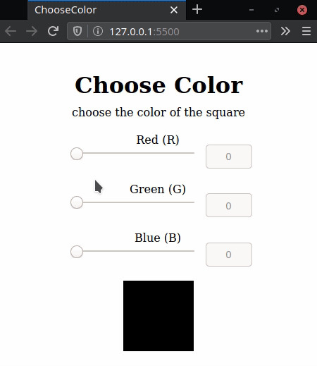

<!-- prettier-ignore -->
<h1 align="center">ChooseColor</h1>

<!-- prettier-ignore -->
<h1 align="center"></h1>

## Sobre

Aplicação para visualização de cores a partir da escala RGB, foi desenvolvido no 1ª desafio no módulo 1 do curso **Bootcamp Desenvolvedor Full Stack** da [**IGTI**](https://www.igti.com.br).

---

## Tecnologias utilizadas

- HTML5
- CSS3
- Javascript

---

Desenvolvido por Denilson Alves
